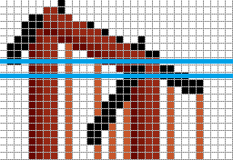

# Sprite File Specification

Specification on how the various sprite data files are formatted for the Windows 95 Special Edition version as well as the DOS version. Includes [MIF](#mif-files) files.

## Windows 95 Sprite Format

This version stores sprite information in `LARGE.DAT`, `SMALLMED.DAT`, `SPECIAL.DAT`.

### Overall File Structure

A header and chunks containing a sprite in them pointed to by the header.

Header starts at address 0x00, and the sprite chunks fill the rest of the file.

### Header Structure

The header contains two parts. A count of total number of sprites stored in the file, and then metadata related to each sprite. There's one metadata per sprite.

_Note:_ some blocks with the same ID appear twice, the second is spurious and can be ignored.

#### Sprite Count

| Offset | Type | Length | Name | Notes |
|--------|------|--------|------|-------|
| 0x00 | Integer | 2B | Sprite Count | Contains the number of entries in the header. |

#### Sprite Metadata

| Offset | Type | Length | Name | Notes |
|--------|------|--------|------|-------|
| 0x00 | Integer | 2B | ID | ID that the chunk represents, this is the same scheme used in XBLD. |
| 0x02 | Integer | 4B | Offset | The absolute offset from the start of the file where the start of a chunk is. |
| 0x06 | Integer | 2B | height | The sprite's height, in pixels. Number of rows. |
| 0x08 | Integer | 2B | width | The sprite's width, in pixels. Number of columns. |

### Sprite Data Structure

Sprite data is made up of a sequence of chunks. Each block stars with metadata about the following pixel data. If count is `0`, then this is a blank row.

| Offset | Type | Length | Name | Notes |
|--------|------|--------|------|-------|
| 0x00 | Integer | 1B | Count | Count, which means different things for different block types. |
| 0x01 | Integer | 1B | Chunk Mode | Pixel data is packed into blocks differently, which is described below. |

#### Pixel Data Chunk

| Offset | Type | Length | Name | Notes |
|--------|------|--------|------|-------|
| 0x00 | Integer | 1B | Count | Varies by mode the pixel data is stored in. |
| 0x01 | Integer | 1B | Mode | Observed to be 0, 3 and 4. See next section for more. |
| 0x02 ... | varies | varies | Pixel Data | Structure varies by pixel mode. |

#### Chunk Mode

There are several different modes pixel data pixel data can be stored in a chunk.

| Chunk Type | Notes |
|------------|-------|
| 0 | Empty block. This is ignored. |
| 1 | Start of a new row. The count specifies the offset to the start of the next row. |
| 2 | End of a sprite. |
| 3 | Skip | Skip the number of pixels specified by the count value. |
| 4 | Actual pixel data. |

##### Pixel Mode 0

Ignored data. Skip this, it seems to be padding/filler.

##### Pixel Mode 3

In this mode, pixels start at an offset from the left edge.

| Offset | Type | Length | Name | Notes |
|--------|------|--------|------|-------|
| 0x00 | Integer | 1B | Edge Offset | Number of pixels from the edge to start the first pixel. |
| 0x02 | Integer | 1B | Pixel Count | Count of pixels in this row. |

#### Pixel Mode 4

| Offset | Type | Length | Name | Notes |
|--------|------|--------|------|-------|
| 0x00 | Integer | 1B | Edge Offset | Number of pixels from the edge to start the first pixel. |
| 0x02 ... | varies | 1B/pixel | Pixel Index | Index into the palette to look up [colour](#colours). |
| Last | Byte | 1B | Null | `0x00` for padding, only if the number of pixels is odd. |

### Colours

There are three palette files in the SC2k `Bitmap/` directory, that contain a 16x16 grid of pixel colours. The actual palette is stored in the bitmap, and is in `BGRX` form, where X is always fixed and can be safely ignored. It is 1024 bytes in size (8bpp). This appears to be standard for the time.

The game colours the pixels it displays based on one of these palettes (`PAL_MSTR.BMP` seems to be the most common one, `PAL_STTC.BMP` has black for colour-cycling indices, so STTC probably means static) based on the pixel's number. It does this by taking the high order nibble of the bit, as an integer and uses that as an index for the row in the 16x16 array of colour values, and the low order nibble as the index to the column.

Example: Pixel has value 0x42 = 0b01000010. Row: `0100` = 4. Column: `0010` = 2. so the index is (4, 2).

### Pixel Data Parsing Example

For this example, we'll look at how the highlighted row is parsed in the following sprite from the suspension bridge. Note that white pixels are transparent in the final result.



With the raw data for the line being:

```raw
24 01 04 03 04 04 2A 29 28 28 01 03 01 04 26 00 03 03 00 00 01 04 26 00 02 03 00 00 08 04 2A 2A 00 00 28 28 00 00
```

Which is parsed as follows:

- Row header `24 01`:
  - `24`: indicates 0x24 (36) bytes following.
  - `01`: indicates chunk mode, in this case, the start of a new row.
- `04 03`:
  - 4 pixels in row mode 3, skip four (transparent) pixels.
- `04 04 2A 29 28 28`:
  - `04 04`: 4 pixels in row mode 4.
  - `2A 29 28 28`: Palette indices to look up.
- `01 03`:
  - 1 pixel in row mode 3, skip one (transparent) pixel.
- `01 04 25 00`:
  - `01 04`: 1 pixel in row mode 4.
  - `25 00`: Palette index 0x25 with a null padding byte. Note that `00` is a valid palette index, but as there's only one pixel, this is a null byte.
- `03 03`
  - 3 pixels in row mode 3, skip 3 pixels left.
- `00 00`
  - Row mode 0, ignored.
- `01 04 26 00`
  - 1 pixel in row mode 4. Palette index 0x26 with a null padding byte.
- `02 03`
  - 2 pixels in row mode 3, skip 2 pixels left.
- `00 00`
  - Row mode 0, ignored.
- `08 04 2A 2A 00 00 28 28 00 00`
  - `08 04`: 8 pixels in mode 4.
  - `2A 2A 00 00 28 28 00 00`:  Palette indices to look up.
- The remainder of the row is assumed to be empty.

## MIF Files

### Overall MIF Structure

Is an IFF file, like the .sc2 file format. Generated in SCURK and loaded into the game to change the way buildings looks.\
First 12 bytes are a header that consists of “MIFF”, length of file, “SC2K”.

Two main sections:\
**INFO:** First 4B is count of length, rest (0x72 in length) appears to be information on the file, including where it was saved from and which version of SCURK it was made with, along with some other unknown information.\
**TILE:** First 4B is length of the contents, next two bytes is the number of sub pieces of data, either SHAP or NAME.

#### NAME

Comes before a SHAP object and changes the name displayed for that object.

| Offset | Type | Length | Name | Notes |
|--------|------|--------|------|-------|
| 0x00 | Integer | 4B | Length | Length of data following. |
| 0x04 | Unknown | 1B | Unknown | Unknown |
| 0x05 | Integer | Building ID | Building type this name applies to. Same indices as the game uses for XBLD.|
| 0x06 | Unknown | 1B | Unknown | Unknown |
| 0x07 | Integer | 1B | Name Length | Number of ASCII characters following for the name. |
| 0x08 ... | ASCII | 1B/character | Name Text | ASCII string with modified name. Maximum string length appears to be 0x16. |

#### SHAP

Metadata related to the sprite (or "shape").

| Offset | Type | Length | Name | Notes |
|--------|------|--------|------|-------|
| 0x00 | Integer | 4B | Length | Length of data following. |
| 0x05 | Integer | Building ID | Building type this name applies to. Same indices as the game uses for XBLD.|
| 0x06 | Integer | 1B | Width | Width in pixels of tile. |
| 0x07 | Integer | 1B | Width | Width in pixels of tile. |
| 0x08 | Integer | 4B | Pixel Data Length | Length of pixel data. |

Observed tile widths: 8px, 16px, 24px, 32px, 48px, 64px, 96px and 128px

_Note:_ Pixel data is in same format as stored in sprite data files, with one change. The end of a file in indicated by a row with the form \x02\x01\x02\x02. Other than that, parsing is the exact same, except that sometimes the pixel count in mode 4 is an odd number with no padding. This is likely due to a bug in SCURK and can be ignored.

## DOS Sprite Format

### Header Data

Header data is stored in `LARGE.HED`, `SMALL.HED` and `OTHER.HED`

These are the header files for the DOS version that describe the contents of the LARGE.DAT, SMALL.DAT and OTHER.DAT sprite files. They are always contained in an archive file with an associated DAT file, either the base archive or a TIL/URK file.

### Overall Header File Structure

Each HED file contains 1500 entries with each entry being 6B + 2B of padding in between.\
Null entries (which do not correspond to a sprite) are all 0xFF, and the padding is always all 0xFF.\

| Offset | Type | Length | Name | Notes |
|--------|------|--------|------|-------|
| 0x00 | Integer | 4B | Offset | Little-endian offset into the DAT file where the sprite begins. |
| 0x04 | Integer | 1B | Height | Sprite height. |
| 0x05 | Integer | 1B | Width | Sprite width. |
| 0x06 | Byte | 2B | Padding | Always 0xFFFF. |

### Sprite Data

Sprite data is stored in `LARGE.DAT`, `SMALL.DAT` and `OTHER.DAT`

Similarly named to the Windows 95 sprite files, these DOS sprite files have a completely different format. It is always contained in an archive file with an associated HED file, either in the base archive or a TIL/URK file.

### Overall Sprite File Structure

DAT files contain sequences of variable length row data. Each sprite starts at an offset specified by the HED file.\
Each row starts with a marker value of 0x10, followed by a 1B int for the number of bytes in the row (this value includes the 1B for the length byte but not the row marker).\
Following the length byte is a byte that specifies the type of the chunk, which have different headers:

- 0x04: This portion of the row starts at the next leftmost pixel. Followed by 1B for the number of pixels in this chunk.
- 0x0C: This portion of the row starts at an offset. Followed by 3B:
  - 1B: The number of pixels for the offset
  - 1B: Unknown
  - 1B: The number of pixels in this chunk

Pixel data follows, which is stored as palette indices, as with the other formats.

Multiple chunks can be stored in the same row to allow for non-adjacent color regions. This is done by specifying a larger number of bytes in the row and putting multiple chunks in a row that don't have enough bytes to fill up the row.

The end of a sprite is marked by 0x00 instead of the 0x10 that marks another row. Some TIL files use the pattern 0x10 0x01 0x00 to mark invalid sprites, as this signifies a sprite with one row with no pixel data in that row.
